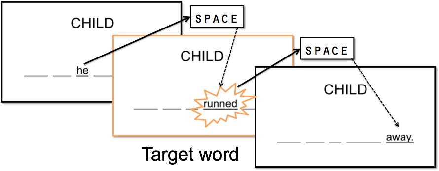
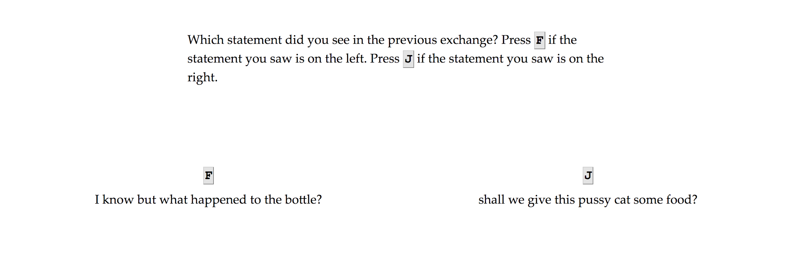

```{r load_packages, include = FALSE}
library(papaja)
library(tidyverse)
library(lme4)
library(lmerTest)
library(tidyboot)
library(ggridges)
library(knitr)
library(kableExtra)

nwords <- function(string, pseudo=F){
  string = gsub("[^[:alpha:][:space:]]", "", string)
  ifelse( pseudo, 
          pattern <- "\\S+", 
          pattern <- "[[:alpha:]]+" 
        )
  str_count(string, pattern)
}
```

```{r analysis_preferences}
# Seed for random number generation
set.seed(42)
```

By the time children begin attending school, they successfully employ language every day to communicate, cooperate, and learn with each other and adults.  This growth from a prelinguistic infant into a fluent language user in so few years is remarkable given the complexity of early language input and relative lack of direct instructions in the grammar rules of language. How might children learn to become competent grammar users?
	
Children receive a large quantity of positive evidence -- information about what is correct to say -- in their language environments (Ambridge & Lieven, 2011, chapter 6). Since children are generally surrounded by many competent language users, they can reasonably take any adult-produced utterance as evidence for its grammaticality. Although positive evidence does not consist of direct instruction, children are able to employ their excellent statistical reasoning to draw conclusions about language from this type of evidence. In unsupervised learning, only positive evidence is available to the learner. That is, if kids learn grammar in an unsupervised learning environment, they must be able to generate rules about grammar only from the grammatical utterances they receive in their linguistic environment. Such a task is not infeasible - in fact, prelinguistic infants are quite capable of learning in an unsupervised context. A major hurdle in language learning is identifying word boundaries from a speech stream. Infants are constrained to the use of positive evidence to overcome this hurdle but succeed nonetheless. Saffran, Aslin, and Newport (1996) found that “a fundamental task of language acquisition, segmentation of words from fluent speech, can be accomplished by 8-month-old infants based solely on the statistical relationships between neighboring speech sounds.” Statistical reasoning of this kind is not limited only to prior experience; infants are also able to generate rules from distributions of language input and apply those rules to novel stimuli, making this ability key for learning language for which there are uncountably many correct but unheard utterances (Aslin & Newport, 2012; Berko, 1958).

Sometimes, however, the rules that infants generate from positive evidence are incorrect or insufficient. It would certainly be helpful if these infants could get feedback when their rules fail, i.e., when they produce ungrammatical utterances. This negative evidence about what is incorrect to produce could greatly simplify the grammar learning problem by providing correction. If children also receive feedback when they produce something ungrammatical, they would learn grammar through supervised learning, i.e., learning in which the learner receives both positive and negative evidence. Some aspects of language learning, namely category labelling, occur in a supervised context. If a child makes a semantic error by labelling a horse as “dog,” parents are likely to respond with correction - “that’s not a dog, that’s a horse” (Newport, Gleitman, & Gleitman, 1977). Are infants learning grammar, like vocabulary,  in a supervised context or is their input set constrained to positive evidence?
If infants learn grammar in a supervised learning context, one might expect explicit parent corrections in response to ungrammatical utterances. However, while parents are likely to correct semantic errors, they are much less likely to correct syntactic errors (Newport et al., 1977). Since children do not receive reliable, explicit negative feedback, do they learn grammar in a completely unsupervised manner? Perhaps children are able to make corrections to their inaccurate understanding of grammar through continued exposure to positive evidence or through innate or environmental constraints (see Bowerman, 1988). Another possibility is that children do receive some negative evidence but such evidence is less explicit than the typical semantic correction. While parents are unlikely to specifically correct their child’s ungrammatical utterance, they will occasionally reformulate the utterance by repeating the content of the child’s utterance in a grammatical structure (Hirsh-Pasek, Treiman, & Schneiderman, 1984; Chouinard & Clark, 2003). For example, a child might produce “I catched the ball” and her father might respond, “Yeah, you caught the ball yesterday at tee-ball practice.”  However, while adults sometimes reformulate child utterances, they do so infrequently. Not only is this an unreliable signal for the child but reformulations are a significant challenge to draw negative information from (Marcus, 1993; Morgan & Travis, 1989).
	
Prior work has found that adults are slower to process an unpredicted utterance (Jurafsky, 1999; Fine & Jaeger, 2013). Given this work, we investigate the possibility that parents may take longer to process their child’s unexpected (i.e., ungrammatical) utterances and thus respond later to their child’s utterance. If parents demonstrate a delay in response to a child’s overregularized utterance, the delay may provide an implicit cue to the child that they produced an incorrect utterance. We propose and investigate a novel form of negative evidence for grammar learning - parent response time.

# Corpus Analyses
## Method
### Child data
Analyses were performed on the Eleanor, Fraser, and Thomas corpora publicly available from the CHILDES database (MacWhinney, 2000). The corpora were chosen due to capturing the age of interest, high recording frequency, and the availability of timing data. See Appendix A for resources regarding recording and transcription procedures for each corpus. To be included in analysis, the data had to meet the following requirements: the speaker must be the child, the responder must be a parent, and there must be valid time codes for both the utterance and response. Since overregularizations, by definition, may only occur in the context of past-tense or plural utterances, overregularized utterances were compared to error-free utterances that contained a past-tense or plural.

#### Thomas
The Thomas corpus consists of 379 60-minute recordings and transcriptions of natural speech interaction primarily between Thomas and his mother (Lieven, Salomo, & Tomasello, 2009). This corpus was chosen due to its density, age range of 2 years; 0 months through 4 years; 11 months that captured several initial and overregularized forms, as well as the presence of timing data. Additionally, Thomas was used in a prior analysis concerning overregularization which indicated the presence of a number of well-recorded overregularizations and served as a check for our methods of retrieving Thomas’s utterances and information about them (see Maslen, Theakston, Lieven, & Tomasello, 2004). Analysis concerned all child-produced past-tense and plural utterances with a direct response from the mother (n=1,540). We limited analysis to utterances to which the mother responded as the proportion of utterances to which the father responded was negligible (n=321; .23% of parent responses).

#### Eleanor
The Eleanor corpus consists of 194 60-minute transcriptions between Eleanor and her parents (Lieven et al., 2009). Although also recorded at a high frequency, the Eleanor and Fraser corpora cover a smaller age range from 2 years, 0 months through 3 years, 0 months. Analysis was limited to all child-produced past-tense and plural utterances with a direct response from either parent (n=550). While most of her exchanges were with her mother (n=402), there was a substantial number (n=148; 26.91%)  of responses from Eleanor’s father as well. As the responses of Eleanor’s father did not vary significantly from the responses of the mother, we considered the responses of both parents in our analysis.

#### Fraser
The Fraser corpus features 216 60-minute transcriptions between Fraser and his parents (Lieven et al., 2009). As noted above, the Fraser corpus covers a smaller age range from 2 years, 0 months, through 3 years, 0 month. Analysis was performed on the set of child-produced past tense or plural utterances for which there was a direct response from the mother (n=870). Although there were responses from Fraser’s father and mother, only his mother’s responses were analyzed because the proportion of father responses was much smaller (n=50; 5.75%) than that constituted by the mother and because the responses by the father varied significantly from those of the mother.

### Pre-Processing
Data for all children were extracted from the XML versions of their transcripts in the CHILDES database (MacWhinney, 2000). Utterances were collected from the corpus by using a Python script to parse the XML transcriptions. An utterance was defined as an entry in the transcript and a response to an utterance Ui was defined as the utterance, Ui+1, immediately following Ui. For each file, the script recorded information about each utterance entry which included the time data, utterance content, response content, speaker, responder, error presence, and the presence of a past-tense or plural in the utterance. This data was then further filtered and analyzed using R. See Appendix A for references regarding source code and data.

### Identification of overregularized utterances
Potential overregularizations were identified as utterances where an error occurred and the child used past tense, past participle, or plural in the utterance. Included in this were errors that occurred in the utterance but were not due to an overregularization of the past tense or plural. For example, the utterance “it did go elephants sleep” is an ungrammatical utterance and includes a plural (“elephants”) but does not feature an incorrectly regularized form. As such, the data that fulfilled the above criteria were selected and then filtered as true overregularizations through hand coding. Utterances that featured an error but were not overregularizations were tagged as “other error.” As such, all overregularizations and all other errors were hand identified.

## Results
Parents took significantly longer to respond to ungrammatical utterances compared to error-free utterances across all three children. When comparing overregularized utterances and error-free utterances that feature a past tense or plural, parents were significantly more likely to overlap their child’s speech when there was no error present in the child’s utterance and least likely to overlap their child’s speech when there was an overregularization error in their child’s utterance.

### Response Time Distributions
Generally, the distribution of response times varied qualitatively in the same way across corpora. Parent response time to grammatical utterances tended to be more negative and much more variable than response time to overregularized and non-regularized ungrammatical utterances. Additionally, response times to overregularized utterances in the Thomas and Eleanor corpora tended to more positive and less variable than response times to ungrammatical utterances that did not contain overregularizations.

```{r}
all_kids <- read_csv("data/all_kids_test_utts.csv", col_names = T)

ggplot(all_kids %>% filter(error_type != "other error"), aes(x=response_time, y = error_type, fill=error_type)) + geom_density_ridges(scale=1, alpha=0.6) + theme_minimal(base_size = 14) + theme(axis.text.y = element_text(vjust = 0)) +
  scale_fill_brewer(palette = "Accent") +
   scale_x_continuous(expand = c(0.01, 0)) +
   scale_y_discrete(expand = c(0.01, 0)) +
  facet_wrap(~kid) +
  xlab("Response Time") +
  ylab("Density by Error Type") +
  theme(legend.position = "none")
```

This qualitative difference was reflected in the mean response time and variance calculations for error types. For all three corpora, there was an extremely significant (p < .001) positive difference between response times to overregularized utterances and response times to grammatical utterances. Reports detailing child-specific results can be found in Appendix B.

```{r}
stats_no_other <- all_kids %>%
  filter(error_type != "other error") %>%
  group_by(kid, error_type) %>%
  tidyboot_mean(response_time, na.rm = T)

# significance
get_ttest <- function(kidName) {
  kid_data = all_kids %>%
    filter(kid == kidName)
  
  noerr = kid_data %>%
    filter(error_type == "no error") %>%
    pull(response_time)
  
  overreg = kid_data %>%
    filter(error_type == "overregularization") %>%
    pull(response_time)
  
  t.test(overreg, noerr)
    
}

eleanor_sig <- get_ttest("Eleanor")
fraser_sig <- get_ttest("Fraser")
thomas_sig <- get_ttest("Thomas")

stats_no_other <- stats_no_other %>%
  mutate(error_type = ifelse(error_type == "no error", "  grammatical       ", "  overregularization       "))

basePlot <- ggplot(stats_no_other, aes(x = kid, y = mean * 1000, 
                           group=error_type, fill=error_type)) + 
  geom_bar(stat="identity", position="dodge") +
  geom_errorbar(aes(ymin=ci_lower*1000, ymax=ci_upper*1000), 
                width = 0.2, position = position_dodge(0.9)) +
  theme_bw(base_size = 14) +
  theme(plot.title = element_text(hjust=0.5), legend.title=element_blank(), legend.position = "top",legend.text=element_text(size=14),panel.background = element_rect(fill = "transparent"), axis.text = element_text(size=14)) +
  guides(fill = guide_legend(keywidth = 1, keyheight = 1)) +
  scale_fill_brewer(palette = "Accent") +
  xlab("Child") +
  ylab("Mean parent response time (ms)") +
  ggtitle("Average Parent Response Time by Grammaticality") +
  coord_cartesian(ylim=(c(-500,500)))

basePlot +
  geom_segment(y = 500, yend = 500, x = 0.8, xend = 1.2) +
  geom_segment(y = 485, yend = 500, x = 0.8, xend = 0.8) +
  geom_segment(y = 485, yend = 500, x = 1.2, xend = 1.2) +
  annotate("text", x = 1, y = 510, label="***") +
  geom_segment(y = 375, yend = 375, x = 1.8, xend = 2.2) +
  geom_segment(y = 360, yend = 375, x = 1.8, xend = 1.8) +
  geom_segment(y = 360, yend = 375, x = 2.2, xend = 2.2) +
  annotate("text", x = 2, y = 385, label="***") +
  geom_segment(y = 375, yend = 375, x = 2.8, xend = 3.2) +
  geom_segment(y = 360, yend = 375, x = 2.8, xend = 2.8) +
  geom_segment(y = 360, yend = 375, x = 3.2, xend = 3.2) +
  annotate("text", x = 3, y = 385, label="***")

```

Thomas and Fraser showed very similar ratios of overregularization production compared to grammatical utterances (Thomas = 23.4%, Fraser = 22.4%) and a similar difference between mean response times of overregularized utterances and grammatical utterances (Thomas = 264ms, Fraser = 292ms). Response times to Eleanor’s utterances generally tended to be much more extreme (Mno error = -278ms, Moverregularization = 312ms) resulting in a much larger difference between response times to grammatical and overregularized utterances (547ms). Additionally, Eleanor’s ratio of overregularizations to grammatical utterances (4.9%) was much smaller than those of Thomas and Fraser.

### Predicting Response Time by Error Type
We fit a mixed-effects linear model to the timing data predicting response times from fixed effects of error type, age, and response length and a random effect of error_type nested within child. In addition, because the scales of response times varied across children (see above), response time was centered and scaled to be on the same normal scale so we could compare across children:
response_time ~ error_type + age + response_length + (error_type | kid)

```{r}
all_lmer <- all_kids %>%
  group_by(kid) %>%
  mutate(response_time = scale(response_time)) %>% 
  lmer(response_time ~ error_type + age + rl + 
                   (error_type | kid), 
                   data = .)

all_lmer %>% summary()
```

Error type (“other error” and “overregularization”) was a significant independent predictor of response time although the p-value for “other error” was slightly above the traditional value. Both overregularizations and errors not due to overregularization correlated with an increase in response time. That is, parents took slightly longer to respond to non-overregularized errors and even longer to respond to overregularized errors. The difference was particularly pronounced for overregularizations, suggesting that there may be something particularly noticeable about overregularizations that could relate to longer response times from parents. However, since the “other error” error type is a catchall for all ungrammatical utterances not containing overregularizations, the particular differences between this error type and overregularizations is unclear. Additionally, age and response length were strongly significant predictors independent of the increase in utterance length that comes with age. The slight decrease with age indicated that parents are faster to respond to their child’s utterances as the child ages irrespective of the MLU increase over development. Not surprisingly, the increase with response length indicated that parents took slightly longer to respond when their response was longer. From these results, we can conclude that parents took longer to respond to their child’s ungrammatical utterances and took a particularly long time to respond to their child’s overregularized utterances. Importantly, this relationship between ungrammaticality and delayed response time occurred independently of age and length of utterance and response.

## Discussion
The strikingly similar change in response time across error types indicated a reliable and consistent relationship between parent response time and grammaticality. Generally, parents tended to overlap their children’s grammatical utterances quite frequently and in a highly variable way. However, when children produced grammatical errors, particularly overregularizations, parents took longer to respond and did so in a less variable way. These effects remained significant factors when controlling for age, utterance time, and utterance and response length. Given that parents appear to respond in a systematically different ways to ungrammatical utterances, it is possible that children are able to make use of this information in the same way they are able to make use of other statistical regularities in their language environment. Even if children are not sensitive to fine-grained response delays, the manifestation of this delay as a decreased likeliness to overlap the child may be a more salient cue children could take as negative evidence. This analysis demonstrated the presence of a reliable statistical difference in response to grammaticality and thus presents a possible form of negative evidence. The availability of a low-level response cue could allow or help children to draw conclusions about the grammaticality of their utterances.

Although parents clearly took longer to respond to their child’s ungrammatical utterances, the nature of parent-child interactions meant that it was impossible to determine if the increased response time was due to the grammaticality of the utterance or some confounding feature of the utterances. To investigate this, we employed an experimental self-paced reading task consisting of utterances from the Thomas and Fraser corpora which were corrected to control for grammaticality.

# Experiments
The goal of our experiments was to confirm the correlational results of our corpus analyses with experimental manipulations that would allow us to make causal inferences about our hypothesis that overregularizations lead to slower processing and consequently slower responses. We wanted to isolate the effect of grammaticality from the surrounding context of the utterance. That is, it is possible that parents responded differently not to the grammatical error in the utterance but rather some other feature that exists in concert with overregularized utterances. As such, the stimuli consisted of overregularized utterances from the Thomas and Fraser corpora. We constructed yoked control trials by correcting the overregularization in each critical utterance to its grammatical irregular form (see Fig. 3). Thus, each test trial varied from its control only in grammaticality of the overrergularized verb. These stimuli were used in a self-paced reading task, a standard paradigm for assessing linguistic processing time that is also appropriate to administer remotely (Keller, Gunasekharan, Mayo, & Corley, 2009).

We revised the procedure over three iterations – a pilot of 10 trials with 9 participants, a full experiment of 20 trials with 40 participants, and a replication with 100 participants. See Appendix A for resources detailing the specific changes in each iteration.

## Method
### Stimuli
 Exchanges each containing one verb overregularization between children and their parents were collected. Control trials were created by manually correcting the overregularization. Acceptable exchanges were those with a minimum of four cogent utterances on the same topic. Test trials consisted of the uncorrected exchanges. A trial consisted of one of the exchanges with each utterance shown on the screen as a moving window task one at a time.
 
```{r}
speakers = c("CHILD", "MOTHER", "CHILD", "MOTHER", "CHILD", "MOTHER")
testExchange = c("are these shorts?", "yeah, they're shorts, aren't
they?", "they're like shorts.", "they are shorts.", "we got some when we goed to the beach, didn't we?",
"that's right.")
controlExchange = c("are these shorts?", "yeah, they're shorts, aren't
they?", "they're like shorts.", "they are shorts.", "we got some when we went to the beach, didn't we?",
"that's right.")
examples <- data.frame(speakers, testExchange, controlExchange)
kable(examples) %>% kable_styling(full_width = F)
```

Attention check questions consisted of two full utterances both displayed on the screen. One utterance was an utterance that was shown and attributed to the mother. The other utterance was an utterance that was not shown. The false utterance was a randomly selected utterance from the same file that was spoken by the mother and roughly (± 1) the same number of words as the correct utterance.

### Procedure
Upon accepting the task, participants saw a screen which provided brief instructions about the experiment and consent information. Participants completed a moving-window self-paced reading task (Just, Carpenter, & Woolley, 1982) for each utterance of a trial followed by an attention check. Each participant viewed 5 ungrammatical test trials and 5 grammatical control trials for each child. Participants viewed instructions about the attention check in the same self-paced manner and completed two practice attention check questions before proceeding to the first trial.

Participants were exposed in random order to 5 randomly selected ungrammatical trials and 5 grammatical control trials for each child. The self-paced reading task consisted of the speaker label (CHILD: or MOTHER:) followed by a set of underlined spaces that represented the words of a single utterance. Participants were instructed to press the spacebar to advance each word. When the spacebar was pressed, the previous word that was displayed disappeared and the next word became visible above its respective underline. A timer began at the press of the spacebar and recorded the time until the spacebar was pressed again. This time was defined as the response time for a particular stimulus.



After participants had advanced through a full exchange, they were shown an attention check question. Each question displayed two utterances - one that had been seen in the exchange and one that had not. The utterance displayed on the left of the screen was labeled with F and the utterance displayed on the right of the screen was labeled with J. Which side the seen utterance was on was randomized. Participants were instructed to press the key on their keyboard which corresponded to the utterance they had seen.



## Pilot Experiment
### Stimuli
Ten exchanges, each containing one verb overregularization between Thomas and his mother were collected. As such, there were a total of 20 possible trials (10 test trials, 10 respective control trials). 

### Participants
Participants (n = 9)  were recruited and tested remotely through Amazon Mechanical Turk.

### Results and discussion
We found some basic predicted effects that provided validity for our procedure. These included an exponential decrease in response time from about 450ms across 2 or 3 words which then stayed around 250 - 300ms until a slight increase nearing the end of utterances. Additionally, all but three attention checks were passed (~4% failure) which indicated that the attention checks were of an appropriate difficulty. It was clear, however, that we were underpowered to find the predicted effect of overregularization. Thus, in Experiment 2, we used a larger set of child utterances and increased the length of the experiment.

## Experiment I
### Participants
Participants (n = 40) were recruited and tested remotely through Amazon Mechanical Turk.

### Stimuli
Following the pilot, we added an additional 10 trials by drawing utterances from the Fraser corpus following the same outline described above. There were ten exchanges found for each child that where then manually corrected to create 40 trials for 20 possible test trials that contained an overregularization and 20 possible control trials. An individual trial consisted of an exchange of several utterances between the relevant child and his mother. 

### Procedure
Each participant viewed 5 ungrammatical test trials and 5 grammatical control for each child for a total of 10 test and 10 control trials. Participants saw all Thomas trials before they saw the Fraser trials. Additionally, participants viewed instructions about the attention check in the same self-paced manner and completed two practice attention check questions before proceeding to the Thomas test trials. After completing all the Thomas trials, participants viewed additional instructions that they would see exchanges between a different child and his mother.

The self-paced reading task followed the same procedure as in the pilot for each child. That is, participants were exposed in random order to 5 randomly selected test trials and 5 control trials for the Thomas utterances and then saw 5 randomly selected test trials and 5 control trials for the Fraser utterances. An attention check question followed every trial for each child.

While each test trial differed from the corresponding control trial by the grammaticality of the test word, the content of each trial may vary a large amount from any other trial because the stimuli were pulled from real parent-child interactions data. Exchanges ranged from 4 to 8 utterances in length but the majority (18 trials of 20) were 5 to 7 utterances long. The total number of utterances labelled as the child’s for Thomas was 26 and for Fraser was 30 and the total number of utterances labelled as the mother’s for Thomas was 31 and for Fraser was 34.

### Results and discussion
We removed all participants that failed more than one attention check (n = 4; 10%) for a total sample of n = 36. Due to the nature of trial content, there were several confounding factors. To control for such factors, we fit a mixed-effect model of the following form: response_time ~ condition * word_position + display_order + utterance_in_exchange  + (word_position + condition | subject) + (word_position + condition | trial)

```{r}
data <- read_csv("./data/3.13_data.csv")

data <- data %>%
  mutate(ul = nwords(utterance))


ac_info <- data %>%
  group_by(subj, trial) %>%
  distinct(.,passed_ac) %>%
  group_by(subj) %>%
  summarise(num_ac_passed = sum(passed_ac), 
            percent_ac_passed = num_ac_passed/n() * 100)

data_with_ac_info <- data %>%
  left_join(ac_info, by="subj")

# Throw out the rude people who didn't pay attention
data <- data_with_ac_info %>%
  filter(percent_ac_passed >= 95)

data <- data %>%
  filter(speaker != "MOM")

error_pos_info <- read_csv("data/error_pos_data.csv")

data <- data %>%
  left_join(., error_pos_info)

cutoffs <- data %>%
  filter(word_response_time > 0) %>%
  mutate(log_rt = log(word_response_time)) %>%
  summarise(sd = sd(log_rt),
            mean = mean(log_rt))

cutoff_data <- data %>%
  filter(word_response_time > 0) %>%
  mutate(log_rt = log(word_response_time)) %>%
  mutate(log_rt = if_else(log_rt > cutoffs$mean + 2.5 * cutoffs$sd,
                          as.numeric(NA), if_else(
                            log_rt <  cutoffs$mean - 2.5 * cutoffs$sd,
                            as.numeric(NA), log_rt)))

comparison_data <- cutoff_data %>%
  filter(is_test_utterance) %>%
  group_by(version, subj, trial, utterance_in_exchange) %>%
  mutate(centered_pos = 1:n()-error_position)

aggregate_data <- comparison_data %>%
  #filter(abs(centered_pos) <= 3) %>% # This seems not to matter
  mutate(word_length = 1,#nchar(gsub("[^A-Za-z]+","",stimulus)),
         rt_per_char = exp(log_rt) / word_length) %>%
  mutate(pos = if_else(centered_pos < 0, "before",
                       if_else(centered_pos > 0, "after", "during"))) %>%
  mutate(pos = factor(pos, levels = c("before", "during", "after"))) %>%
  group_by(version, pos, trial, subj, utterance_in_exchange, 
            true_display_order) %>%
   summarise(rt_per_char = mean(rt_per_char), na.rm = T)

char_model <- lmer(rt_per_char ~ version * pos + 
                     true_display_order + utterance_in_exchange  +
                     (pos + version| subj) + 
                     (pos + version| trial),
     data = aggregate_data) 

predicted_data <- aggregate_data %>%
  filter(!is.na(rt_per_char)) %>%
  ungroup() %>%
  mutate(predicted = predict(char_model, re.form = NA))

cor.test(predicted_data$predicted, predicted_data$rt_per_char)

plot_data <- aggregate_data %>%
  group_by(version, pos, subj, trial) %>%
  summarise(rt_per_char = mean(rt_per_char, na.rm = T)) %>%
  summarise(rt_per_char = mean(rt_per_char, na.rm = T)) %>%
  summarise(sem = sqrt(var(rt_per_char, na.rm = T) / 
                         sum(!is.na(rt_per_char))),
            empirical_stat = mean(rt_per_char, na.rm = T)) %>%
  mutate(ci_upper = empirical_stat + sem, ci_lower = empirical_stat - sem)

plot_data <- plot_data %>%
  ungroup() %>%
  mutate(version = ifelse(version == "g", "grammatical", "ungrammatical"))

ggplot(plot_data, aes(x = pos, y = empirical_stat, color = version)) +
  geom_pointrange(aes(ymin = ci_lower, ymax = ci_upper), 
                      position = position_dodge(.5)) +
  ylab("Mean Response Time (ms)") +
  xlab("") +
  theme(legend.title = element_blank()) +
  scale_fill_brewer(palette="Accent") +
  scale_color_brewer(palette="Accent") +
  theme_classic(base_size = 16) +
  theme(plot.title = element_text(hjust=0.5), legend.title=element_blank(), legend.position = "top",legend.text=element_text(size=16), axis.text = element_text(size=16)) +
  guides(color = guide_legend(override.aes = list(size=0.75))) +
  ggtitle("RT Before, During, and After Target Word")
```

We predicted that if overregularizations cause a processing delay then participants would have increased response time to and following the test word in ungrammatical trials. This effect was slight but significant in response times to words following the test word but not to the test word. That is, independent of training effects and general position effects, participants took longer to respond to words after reading an overregularization than they did after reading a correct irregular. This indicates that overregularizations independent of other characteristics of a given utterance can result in a processing delay.

## Experiment II
The analysis that was conducted on Experiment 1 yielded successful results but was constructed post-hoc. We wanted to replicate the results found knowing in advance the analysis that we would employ so we repeated the experiment using an identical procedure with a larger sample size.

### Participants
We followed Simonsohn's recommendation (2015) of a replication sample size that was 2.5 times the size of the original study. As such, we recruited n = 100 participants on Amazon Mechanical Turk.

### Stimuli
The trials used were identical to those in Experiment 1 with the small exception of correcting the label on a single utterance in one trial. In the prior experiment, the utterance was labelled “MOM” and in this iteration we corrected it to be labelled “MOTHER” as in all other mother-produced utterances.

### Procedure
The procedure was identical to that employed in Experiment I.

### Results and discussion
We again removed all data from participants that did not pass at least 95% (19/20) of the attention checks. This resulted in 11 participants being removed from analysis for a total of n = 89. Once again we fit a mixed-effects model to control for subject, training, and position effects.

```{r}
DATA_FILE <- "data/replication_data.csv"
data <- read_csv(DATA_FILE)

utterance_data <- data %>%
  mutate(ul = nwords(utterance))

ac_info <- utterance_data %>%
  group_by(subj, trial) %>%
  distinct(passed_ac) %>%
  group_by(subj) %>%
  summarise(num_ac_passed = sum(passed_ac), 
            percent_ac_passed = num_ac_passed/n() * 100)

data_with_ac_info <- utterance_data %>%
  left_join(ac_info, by="subj")

# Throw out the rude people who didn't pay attention
checked_data <- data_with_ac_info %>%
  filter(percent_ac_passed >= 95)

# error pos data
error_pos_info <- read_csv("data/error_pos_data.csv")

# add in error positions
pos_data <- checked_data %>%
  left_join(error_pos_info)


comparison_data <- pos_data %>%
  filter(is_test_utterance) %>%
  mutate(word_response_time = 
           if_else(word_response_time < 100, 
                   as.numeric(NA), 
                   if_else(word_response_time > 1000, as.numeric(NA),
                           as.numeric(word_response_time)))) %>%
  group_by( version, utterance_in_exchange, subj, trial) %>%
  mutate(centered_pos = 1:n()-error_position)

aggregate_data <- comparison_data %>%
  filter(abs(centered_pos) <= (error_position - 1)) %>% # This seems not to matter
  mutate(word_length = 1,#nchar(gsub("[^A-Za-z]+","",stimulus)),
         rt_per_char = word_response_time / word_length) %>%
  mutate(pos = if_else(centered_pos < 0, "before",
                       if_else(centered_pos > 0, "after", "at"))) %>%
  mutate(pos = factor(pos, levels = c("before", "at", "after"))) %>%
  group_by(version, pos, utterance_in_exchange, true_display_order, 
           trial, subj) %>%
   summarise(word_response_time = mean(word_response_time), rt_per_char = mean(rt_per_char))

# Most maximal model that will converge using previous data. If this model does not converge, we will prioritize keeping the pos * version interaction in trial given the variability across trials
maximal_model <- lmer(word_response_time ~ version * pos + 
                     true_display_order + utterance_in_exchange  +
                     (pos + version| subj) + 
                     (pos * version| trial), 
     data = aggregate_data) 

summary(maximal_model)

predicted_data <- aggregate_data %>%
  filter(!is.na(word_response_time)) %>%
  ungroup() %>%
  mutate(predicted = predict(maximal_model, re.form = NA))

cor.test(predicted_data$predicted, predicted_data$word_response_time)

t.test(word_response_time ~ version, aggregate_data %>% filter(pos == "after"))
```

We successfully replicated our results from the prior experiment. There was an interaction effect of condition and word position in test utterance such that participants took significantly longer to respond to words after seeing an overregularized word than after seeing a grammatical word. According to the mixed-effects model, this effect was significant independent from general position and training effects.


```{r}
plot_data <- aggregate_data %>%
  group_by(version, pos, subj, trial) %>%
  summarise(rt_per_char = mean(rt_per_char, na.rm = T)) %>%
  summarise(rt_per_char = mean(rt_per_char, na.rm = T)) %>%
  summarise(sem = sqrt(var(rt_per_char, na.rm = T) / 
                         sum(!is.na(rt_per_char))),
            empirical_stat = mean(rt_per_char, na.rm = T)) %>%
  mutate(ci_upper = empirical_stat + sem, ci_lower = empirical_stat - sem)

plot_data <- plot_data %>%
  ungroup() %>%
  mutate(version = ifelse(version == "g", "grammatical", "ungrammatical"))

ggplot(plot_data, aes(x = pos, y = empirical_stat, color = version)) +
  geom_pointrange(aes(ymin = ci_lower, ymax = ci_upper), position = position_dodge(.5)) +
  ylab("Mean Response Time (ms)") +
  xlab("") +
  theme(legend.title = element_blank()) +
  scale_fill_brewer(palette="Accent") +
  scale_color_brewer(palette="Accent") +
  theme_classic(base_size = 16) +
  theme(plot.title = element_text(hjust=0.5), legend.title=element_blank(), legend.position = "top",legend.text=element_text(size=16),panel.background = element_rect(fill = "transparent"), axis.text = element_text(size=16)) +
  guides(color = guide_legend(override.aes = list(size=0.75))) +
  ggtitle("RT Before, During, and After Target Word")

```

# General Discussion
We hypothesized that there exists a lower-level form of negative evidence - parent response time. By examining three CHILDES corpora we found that parents do, in fact, respond reliably later to ungrammatical past tense and plural utterances. Additionally, parents appear to take particularly long to respond to overregularizations than to utterances that are ungrammatical for other reasons. We were also able to conclude from experiments 1 and 2 that adults take longer to respond utterances due to the presence of overregularizations specifically rather than some confounding feature of the utterance. By using a self-paced reading procedure, we claimed that this increase in response time is due to processing difficulty rather than another factor such as desire to correct.

## Future Directions
Given the consistency of the change in response times across distinct corpora and even research projects, further work might consider employing additional child-parent interaction corpora to complete a large-scale analysis of parent response times. To better understand the driving forces behind parent response time latencies, several experiments should be conducted which more closely match the environment in which parents are responding to their children. A clear extension of study 2 would be an online self-paced listening task. Additionally, future work should consider how parents may adapt to their child’s particular language errors over time. For instance, perhaps it is more surprising and subsequently more difficult to process when their child does not overregularize something that they frequently overregularize.

Also important to consider is how surprising certain overregularizations appear both when listening - in the case of parents, and when reading - in the case of our online self-paced reading task. One reasonable way we’ve considered investigating this is to compute the Levenshtein distance between a given overregularization and the correct regularization on the IPA transcription of the overregularization. We anticipate that response time will increase with increased Levenshtein distance.

Finally, an experimental procedure which attempts to teach children an artificial grammar by varying the response time latency of conversational responses would be an excellent next step for examining whether children are sensitive to and can learn from response time delays of the scale we found in natural parent-child interactions.

## Conclusions
The presence of a reliable delay in response time from parents across age in response to ungrammatical utterances indicates that there is a lower level signal of grammaticality that could act as negative evidence for grammar learning. Significantly, the presentation of new forms of negative evidence could address the “no negative evidence problem” that has led many researchers to conclude, perhaps prematurely, that there must exist innate constraints on grammar learning (Bowerman, 1988). This examination of a little-researched form of negative evidence raises the question of what other cues might provide informative feedback for language learning.


\newpage

# References

\begingroup
\setlength{\parindent}{-0.5in}
\setlength{\leftskip}{0.5in}

<div id = "refs"></div>
\endgroup
